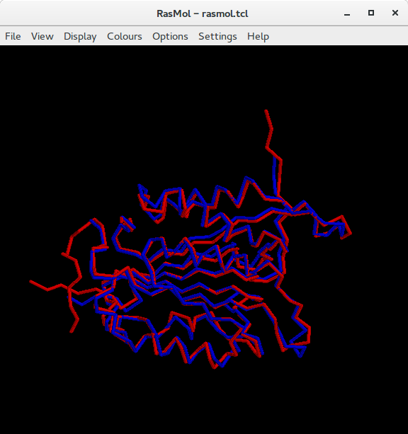
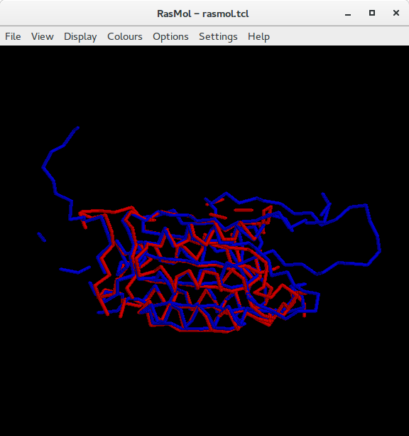
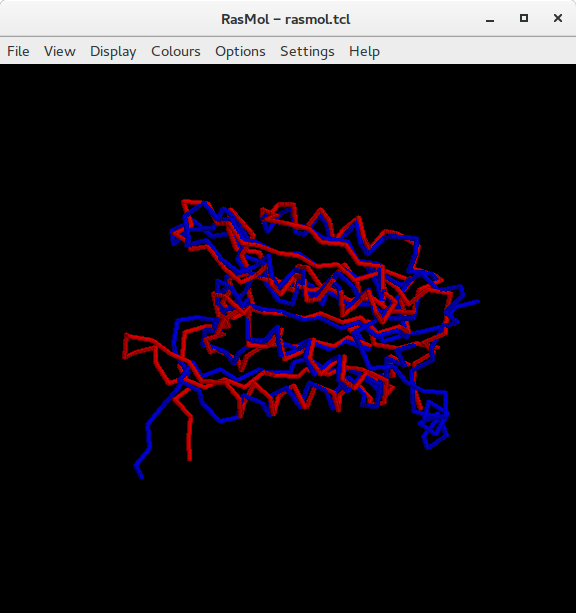

```{r setup, include=FALSE}
knitr::opts_chunk$set(echo = TRUE)
```

1. Selecciona una superfamilia de proteínas de SCOP (http://scop.berkeley.edu) y extrae la secuencia de aminoácidos (ATOM records) y las coordenadas PDB de varios dominios de la misma. Podéis ver un ejemplo de dominio en http://scop.berkeley.edu/sunid=29763 , y abajo están tanto la secuencia como una liga para descargar las coordenadas.

 * Class c: Alpha and beta proteins (a/b) 
 * Fold: Caspase-like
 * Superfamily c.17.1: Caspase-like
 * Family c.17.1.1: Caspase catalytic domain

 * Protein domains:
	+ Apopain - H sapiens - Domain d1cp3b_: 1cp3 B
	+ Caspase-1 - Fall armyworm - Domain d1m72b_: 1m72 B
	+ Caspase-7 - H sapiens - Domain d1gqfb_: 1gqf B
	+ Caspase-9 - H sapiens - Domain d1jxqb_: 1jxq B
	+ Interleukin-1beta converting enzyme - H sapiens- d1ibc.1: 1ibc A:,B
  
2. Comprueba que las secuencias descargadas coinciden con las coordenadas.

3. Calcula al menos dos alineamiento pareados entre secuencias de aminoácidos de las extraídas en 1 y calcula su %identidad como el total de parejas de residuos idénticas / total parejas alineadas.

Los alineamientos fueron calculados con BLASTp, utilizando la matriz de sustitución BLOSUM80, Gap cost: Existance 6 Extension 2.

	* Apopain vs Caspase-1
    Identidad = 41%   96/234

	* Caspase-7 vs Caspase-9
    Identidad = 34%   74/219

	* Interleukin vs Apopain
    Identidad = 32%   63/196


4. Calcula con mammoth los alineamientos estructurales de los dominios que ya alineaste en 3 en base a su secuencia. Visualízalos con Rasmol como se explica en http://eead-csic-compbio.github.io/bioinformatica_estructural/node32.html. El software está en /home/compu2/algoritmos3D/soft/mammoth-1.0-src para que lo copien y compilen con gfortram como se explica en README, cambiando g77 por gfortran.

	* Apopain vs Caspase-1

	

	* Caspase-7 vs Caspase-9

  

	* Interleukin vs Apopain

  


5. Compara los alineamientos obtenidos en 3 y 4. Comenta en qué elementos de estructura secundaria se observan diferencias.

Los alineamientos en 3 demuestran identidades muy bajas, lo que nos hace pensar que las proteínas probablemente no son homólogas. No es hasta ver los alineamientos con Rasmol que vemos la gran similitud entre la estructura de las proteínas. Al final, lo que importa en la proteína es la estructura más que la secuencia, y esto puede apreciarse en la conservación. La estructura entre los pares de proteínas es casi la misma, las diferencias más notables las podemos observar en los extremos N-terminal y C-terminal, que no suelen verse plegados, y el de una proteína suele ser más largo que el otro.

6. Utiliza el prog3.1 (en http://eead-csic-compbio.github.io/bioinformatica_estructural/node31.html) para calcular el error (RMSD) de los alineamientos obtenidos en 3 y 4 y comenta los resultados. Son mejores o peores los alineamientos basados en secuencia desde el punto de vista del RMSD?

  * Apopain vs Caspase 1
    + BLAST:  
      -total residuos alineados = 227  
      -RMSD = 20.08 Angstrom  

    + MAMMOTH:
      -total residuos alineados = 230
      -RMSD = 3.89 Angstrom

  * Interleukin vs Apopain
    + BLAST:  
      -total residuos alineados =  179
      -RMSD =  19.28 Angstrom

    + MAMMOTH:
      -total residuos alineados = 219
      -RMSD = 4.80 Angstrom
      
Los alineamientos basados en estructura alinean un mayor número de residuos, y tienen un RSMD menor, por lo que son mejores en cuanto estructura. Esto nos refuerza la idea de que lo importante en una proteína no es su secuencia, sino su configuración.      
