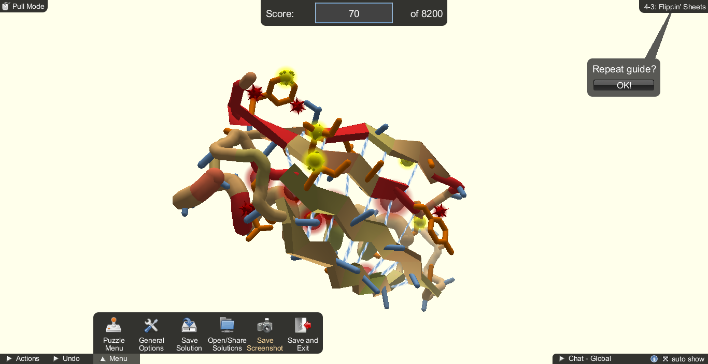

```{r setup, include=FALSE}
knitr::opts_chunk$set(echo = TRUE)
```

Completar los puzzles de Foldit al menos hasta el nivel 4-5, y por el camino tomar capturas de pantalla que reflejen algunos de los conceptos teóricos:


1. Ejemplo de aminoácido con cadena lateral aromática
 

 
En la imagen se muestra una tirosina, marcada con color anaranjado.  

2. Ejemplo de aminoácido con cadena lateral chica


El aminoácido central puede ser una valina o una leucina.  

3. Ejemplo de giro en torno a los ángulos phi/psi de un residuo seleccionado, ¿que pasa cuando sus vecinos tienen cadenas laterales voluminosas?


  
En la segunda imagen se muestra que el segemento de cadena marcdo con rojo ha sido rotado, lo que ocasiona colisiones (esferas puntiagudas rojas) con los residuos vecinos.  

4. Ejemplo de puentes de hidrógeno entre resíduos de una alfa-hélice y entre hojas de una lámina beta. Desde el punto de vista algorítmico, cuál de los estados de estructura secundaria les parece más difícil de programar?

Alfa hélice:


Se muestran las interacciones entre una alfa hélice y una lámina beta, formadas por tres puentes de hidrógeno (color azul).

Lámina beta:


Se muestran las interacciones entre trés láminas beta.
  
Considero que es más difćil programar las interacciones entre láminas beta. En las alfa hélices, los residuos que interaccionan entre si son consecutivos, mientras que en las láminas las interacciones podrian ser con aminoácidos muy alejados en secuencia, por lo que es más difícil predecirlos. Además, la composición de las alfa hélices suele ser algo sesgada, lo que facilita su reconocimiento.
  
  
5. Ejemplo de residuo hidrofóbico expuesto y luego correctamente "enterrado" tras operaciones con los vecinos.




En este ejemplo, en la segunda imagen se rotó una lámina beta para esconder los residuos hidrofóbicos, lo que se aprecia con la desaparición de las esferas amarillas.
  
  
6. Ejemplo de conformaciones distintas con puntuaciones similares, para hacer patente el problema de evaluar lo correcto de una conformación.


Ambas conformaciones tienen una puntuación muy similar, pero en el primer caso una de las hélices se aleja de la estructura mientras que en el segundo caso la hélice está vuelta hacia el otro lado (hacia dentro).
  
  
7. De acuerdo con http://eead-csic-compbio.github.io/bioinformatica_estructural/node17.html calcula el tiempo que llevaría explorar todas las conformaciones posibles de uno de los péptidos o proteínas que utilicen en los puzzles.


  
Número de aminoácidos: 43

Número de estados diferentes: X

Tiempo en cambiar de estado: t
  
Número de conformaciones diferentes: 43^X

Tiempo total: t*43^X
  
Si suponemos X=10 yt=10^-13 s, el tiempo total será de 10^-13 * 43^10 = 2161.1482 segundos = 36 minutos para un péptido de 43 aminoácidos.

