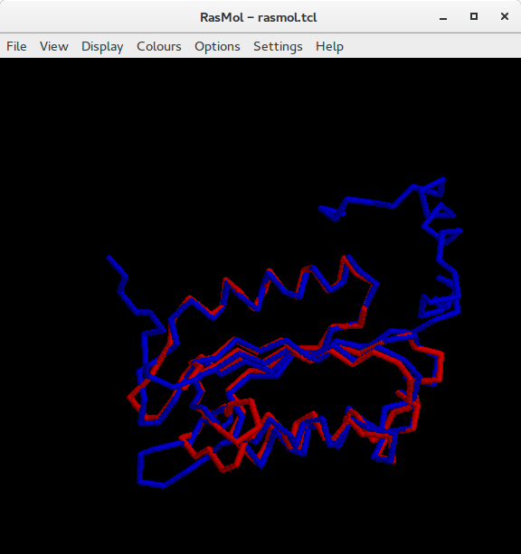
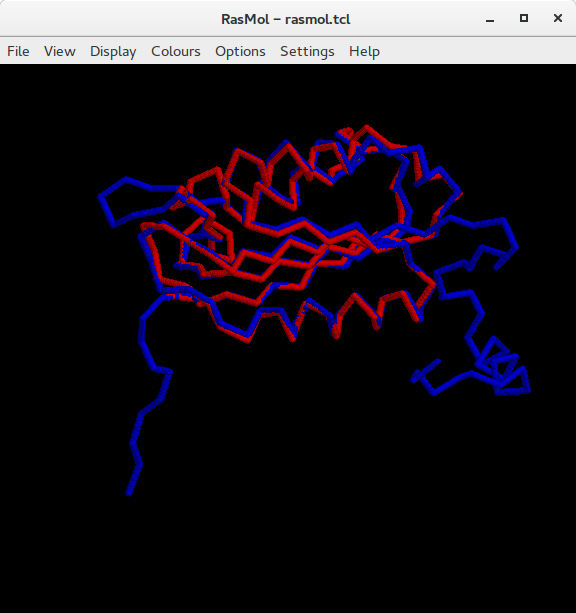

```{r setup, include=FALSE}
knitr::opts_chunk$set(echo = TRUE)
```

La tarea 4 consiste en aprender a modelar y evaluar un modelo 3D de una proteína:

1. Elige una secuencia S de la superfamilia que elegiste para la tarea 3.

Yo elegí Interleukine, de la familia de las caspasas. [PDB](http://www.rcsb.org/pdb/explore.do?structureId=1ibc).  


2. Usando HHpred (http://toolkit.tuebingen.mpg.de/hhpred) selecciona al menos una estructura molde o template que puedas usar para modelar S, asegurándote que tiene menos del 90% de identidad si fuera posible.

Mi molde será Caspasa-9, ya que tiene un 34% de identidad con Interleukin. [PDB](http://www.rcsb.org/pdb/explore.do?structureId=1jxq).  


3. De acuerdo con el ejemplo de http://eead-csic-compbio.github.io/bioinformatica_estructural/node34.html y la documentación de MODELLER construye dos modelos M1 y M2 de S y comprueba su estima de calidad con DOPE.

Usando el file .pdb de Caspasa 9, se corrió MODELLER para predecir la estructura de Interleukin.  

**Summary of successfully produced models:**

Filename    |    molpdf    |    DOPE score
----------- | ------------ | --------------
query.B99990001.pdb   |    774.74829    |    -11493.41602
query.B99990002.pdb   |    733.07507    |    -11543.05176


4. Evalúa la calidad de los modelos M obtenidos comparándolos con la estructura conocida, que descargaste de SCOP en la tarea 3. Para ello puedes usar MAMMOTH. En tu informe por favor indica el alineamiento obtenido, el RMSD y al menos una imagen de su superposición para brevemente comentar las diferencias que observas entre cada modelo y la estructura experimental.

  * Interleukin - Modelo 1
    + Alineamiento: Prediction: pdb de Interleukin, Experiment: Modelo 1
  
                                                ****** **********
Prediction GNVKLCSLEE AQRIWKQKSA EIYPIMDKSS RTRLALIICN EEFDSIPRRT
Prediction SSSSSSS-HH HHHHHHHHH- --SSSSS--- SSSSSSSSSS SS-----HHH
                                                |||||| ||||||||||
Experiment ---------- ---------- ---------- ----SSSSSS SSS----HHH
Experiment .......... .......... .......... ....ALIICN EEFDSIPRRT
                                                ****** **********
  
           ********** ********** ********** ********** **********
Prediction GAEVDITGMT MLLQNLGYSV DVKKNLTASD MTTELEAFAH RPEHKTSDST
Prediction HHHHHHHHHH HHHH----SS SSSS-----H HHHHHHHHHH HHHH----SS
           |||||||||| |||||||||| |||||||||| ||||||      |||||||||
Experiment HHHHHHHHHH HHHH----SS SSSS-----H HHHHHHHHHH HHHH----SS
Experiment GAEVDITGMT MLLQNLGYSV DVKKNLTASD MTTELEAFAH RPEHKTSDST
           ********** ********** ********** ********** **********
  
           ******  ** *****    *    ******* ********** **********
Prediction FLVFMS..HG IREGICGKKH SEQVPDILQL NAIFNMLNTK NCPSLKDKPK
Prediction SSSSS----- ----SS---- ----HHHHHH HHHHHHHHH- --SSS---SS
           ||||||  || |||         ||||||||| |||||||||| ||||||||||
Experiment SSSS------ -------SSS ----HHHHHH HHHHHHHHH- ---SSS--SS
Experiment FLVFMSHGIR EGICG..KKH SEQVPDILQL NAIFNMLNTK NCPSLKDKPK
           ******  ** *****    *    ******* ********** **********
  
           *********          
Prediction VIIIQACRGD SPGVVWFK
Prediction SSSSSSSS-- SSSSSSSS
           |||                
Experiment SSSSSSSSS- --------
Experiment VIIIQACRG. ........
           *********          

    + RSMD
    
      Total residuos alineados = 121

      RMSD = 3.05 Angstrom

    + Superposición

  	
  
    + Observaciones
  
EL modelo se ve bastante bien, salvo los extremos terminales, ya que el modelo es un poco más corto que la estructura (Interleukin). También se ve una diferencia en la esquina inferior izquierda, donde se aprecia un loop en la estructura que no se pudo predecir en el molde (al momento de hacer el alineamiento, caspasa-9 tenía un gap de 10 nucleótidos, en donde cae este loop).
  
  
  * Interleukin - Modelo 2
    + Alineamiento
                                                ****** **********
Prediction GNVKLCSLEE AQRIWKQKSA EIYPIMDKSS RTRLALIICN EEFDSIPRRT
Prediction SSSSSSS-HH HHHHHHHHH- --SSSSS--- SSSSSSSSSS SS-----HHH
                                                |||||| ||||||||||
Experiment ---------- ---------- ---------- ----SSSSSS SS-----HHH
Experiment .......... .......... .......... ....ALIICN EEFDSIPRRT
                                                ****** **********
  
           ********** ********** ********** ********** **********
Prediction GAEVDITGMT MLLQNLGYSV DVKKNLTASD MTTELEAFAH RPEHKTSDST
Prediction HHHHHHHHHH HHHH----SS SSSS-----H HHHHHHHHHH HHHH----SS
           |||||||||| |||||||||| |||||||||| ||||||  || ||||||||||
Experiment HHHHHHHHHH HHHH----SS SSSS-----H HHHHHHHHHH HHHH----SS
Experiment GAEVDITGMT MLLQNLGYSV DVKKNLTASD MTTELEAFAH RPEHKTSDST
           ********** ********** ********** ********** **********
  
           ********** ***    *    ********* ********** **********
Prediction FLVFMSHGIR EGICGKKHSE QVPDILQLNA IFNMLNTKNC PSLKDKPKVI
Prediction SSSSS----- --SS------ --HHHHHHHH HHHHHHH--- SSS---SSSS
           ||||||||         ||      ||||||| |||||||||| ||||||||||
Experiment SSSS------ -----SS--- --HHHHHHHH HHHHHHH--- SSS---SSSS
Experiment FLVFMSHGIR EGICGKKHSE QVPDILQLNA IFNMLNTKNC PSLKDKPKVI
           ********** ***    *    ********* ********** **********
  
           *******          
Prediction IIQACRGDSP GVVWFK
Prediction SSSSSS--SS SSSSSS
           |                
Experiment SSSSSSS--- ------
Experiment IIQACRG... ......
           *******          

    + RSMD

      Total residuos alineados = 123

      RMSD = 3.31 Angstrom

    + Superposición

    
	
    +Observaciones
	
Es prácticamente idéntico al modelo anterior, con las mismas diferencias en la superposición de las proteínas (incluido el loop).